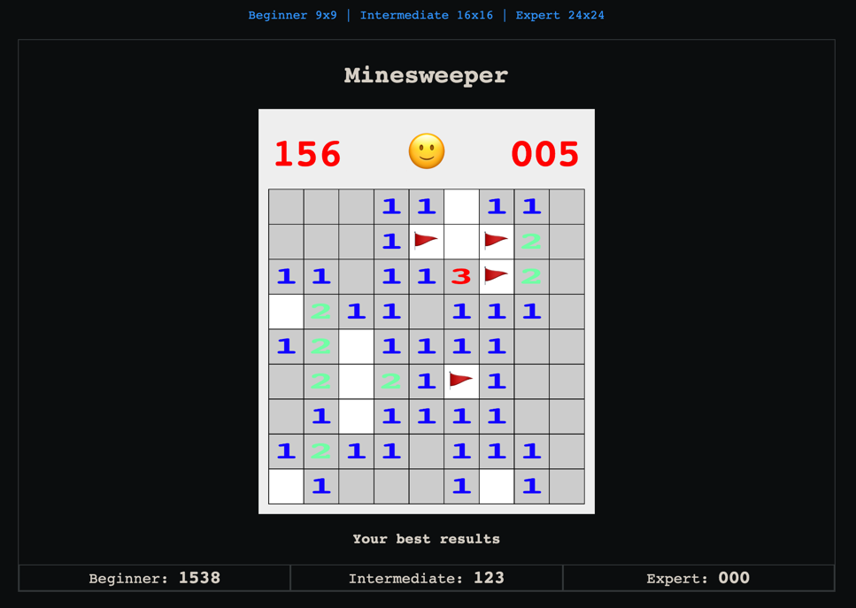

## Minesweeper

Minesweeper is a game where you try to find the mines in a grid of squares. The objective of the game is to clear a rectangular board containing hidden "mines" or bombs without detonating any of them, with help from clues about the number of neighboring mines in each field.

You can place flags on each block to make sure you won't step on it. Mouse click or long touch is placing flags on the blocks.

Written in Typescript with PIXI.js

This branch is integration version for [Crazy Games](crazygames.com) platform.

[Play online](https://n1md7.github.io/minesweeper/)

